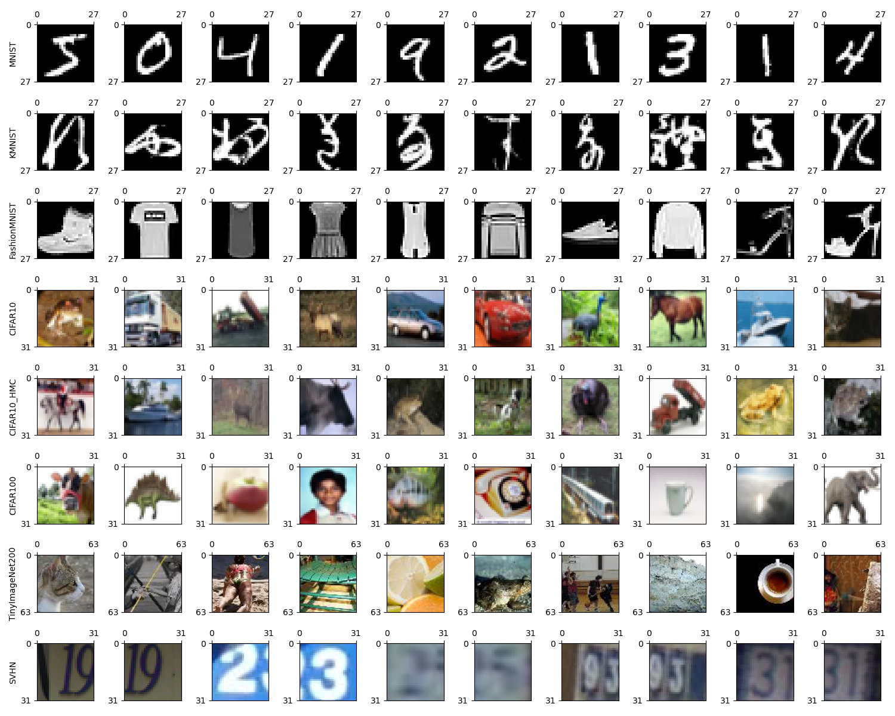

# Builtin Datasets

## Preview

```
python preview.py
```


## Download

### [MNIST](http://yann.lecun.com/exdb/mnist/)
```
wget https://www.dropbox.com/s/y18xf25kyna3u50/MNIST.tar.gz
tar -xvzf MNIST.tar.gz
```

### [KMNIST](https://github.com/rois-codh/kmnist)
```
wget https://www.dropbox.com/s/crdkhcfs9jfs3m3/KMNIST.tar.gz
tar -xvzf KMNIST.tar.gz
```

### [FashionMNIST](https://github.com/zalandoresearch/fashion-mnist)
```
wget https://www.dropbox.com/s/nlbxznph3mc3se2/FashionMNIST.tar.gz
tar -xvzf FashionMNIST.tar.gz
```

### [CIFAR10](https://www.cs.toronto.edu/~kriz/cifar.html)
```
wget https://www.dropbox.com/s/3w9srxvvos3xaj3/CIFAR10.tar.gz
tar -xvzf CIFAR10.tar.gz
```

### [CIFAR10_HMC](https://www.tensorflow.org/datasets/catalog/cifar10)
```
wget https://www.dropbox.com/s/8s5unpaxdrt6r7e/CIFAR10_HMC.tar.gz
tar -xvzf CIFAR10_HMC.tar.gz
```

### [CIFAR100](https://www.cs.toronto.edu/~kriz/cifar.html)
```
wget https://www.dropbox.com/s/wra2ol0rzq4twjh/CIFAR100.tar.gz
tar -xvzf CIFAR100.tar.gz
```
